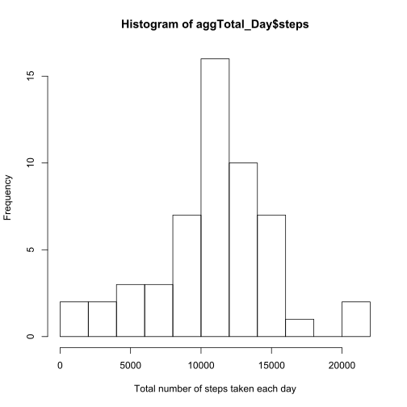
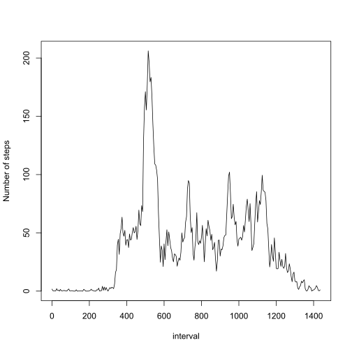
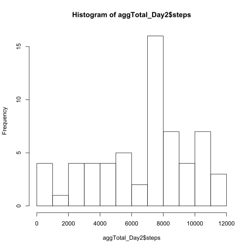
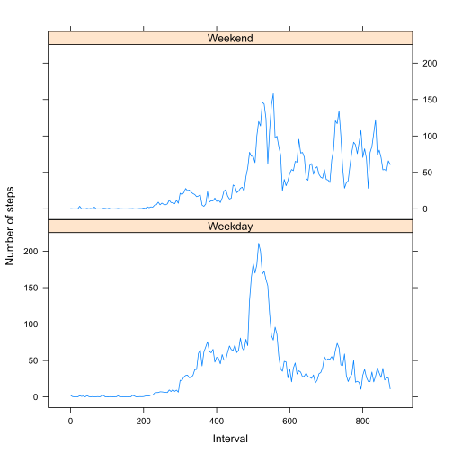

## Loading and preprocessing the data

```r
par(mfrow=c(1,1))
theData <- read.csv("repdata_data_activity/activity.csv",sep = ",", na.strings = "NA",stringsAsFactors=FALSE)
```

```
## Warning in file(file, "rt"): cannot open file 'repdata_data_activity/
## activity.csv': No such file or directory
```

```
## Error in file(file, "rt"): cannot open the connection
```

## What is mean total number of steps taken per day?

### Histogram of the total number of steps taken each day

I aggregate nb of steps per day


```r
aggTotal_Day<-aggregate(steps~date, data=theData, sum, na.rm=TRUE) 
hist(aggTotal_Day$steps, xlab="Total number of steps taken each day", breaks=10)
```

 

### Mean and median of the total number of steps taken per day

```r
meanTot <- mean(aggTotal_Day$steps)
medianTot <- median(aggTotal_Day$steps)
```

The mean is 1.0766189 &times; 10<sup>4</sup>. The median is 10765

## What is the average daily activity pattern?

### Time series plot of 5-minute interval and average number of steps taken, averaged across all days

I aggregate average nb of steps per interval
I transform interval into nb of 5-minutes slices since midnight


```r
aggMean_Interval<-aggregate(steps~interval,data=theData,mean,na.rm=TRUE) 
aggMean_Interval$interval <- trunc(aggMean_Interval$interval/100)*60+(aggMean_Interval$interval-trunc(aggMean_Interval$interval/100)*100)

plot(aggMean_Interval$interval, aggMean_Interval$steps, type="l",xlab="interval", ylab="Number of steps")
```

 

### Which 5-minute interval contains the maximum number of steps?

```r
s <- subset(aggMean_Interval, aggMean_Interval$steps == max(aggMean_Interval$steps))
minInterv <- s$interval
```

The 5-minute interval contains the maximum number of steps is 515

## Imputing missing values

### Total number of missing values in the dataset

```r
nbNA <- sum(is.na(theData$steps))
```

The Total number of missing values in the dataset is 2304

### Strategy for filling in all of the missing values in the dataset. 

I replace all missing values by the average number of steps per interval, as calculated previously 

### New dataset that is equal to the original dataset but with the missing data filled in.

I rename column name for means in previous agregation 
I merge with initial data by common variable whichis interval
I fill missing datas

```r
names(aggMean_Interval)[2] <- "stepsMean" # 
mergedData <- merge(theData,aggMean_Interval) 

mergedData$steps[is.na(mergedData$steps)] <-  
  mergedData$stepsMean[is.na(mergedData$steps)]   # set missing values to their corresponding group means 
```

### Histogram of the total number of steps taken each day 

I aggregate total nb of steps per day


```r
aggTotal_Day2<-aggregate(steps~date, data=mergedData, sum, na.rm=TRUE) 
hist(aggTotal_Day2$steps, breaks=10)
```

 

### Mean and median total number of steps taken per day. 

```r
meanTot <- mean(aggTotal_Day2$steps)
medianTot <- median(aggTotal_Day2$steps)
```

The mean is 6696.6019177. Them median is 7075.3396226

These values do not differ from the estimates from the first part of the assignment
There is no impact of imputing missing data on the estimates of the total daily number of steps

## Are there differences in activity patterns between weekdays and weekends?

### Create a new factor variable in the dataset with two levels -- "weekday" and "weekend" indicating whether a given date is a weekday or weekend day.


```r
Sys.setlocale("LC_TIME", "English")
```

```
## [1] "English_United States.1252"
```

```r
mergedData$DateTime <- strptime(mergedData$date, format = "%Y-%m-%d")
mergedData$WeekEnd <- as.numeric(weekdays(mergedData$DateTime)%in%c("Sunday","Saturday")) #I create a new field giving weekday
mergedData$WeekEnd <- factor(mergedData$WeekEnd, labels = c("Weekday", "Weekend"))
```

### Make a panel plot containing a time series plot (i.e. type = "l") of the 5-minute interval (x-axis) and the average number of steps taken, averaged across all weekday days or weekend days (y-axis)


```r
aggMean_Interval3<-aggregate(steps~interval+WeekEnd,data=mergedData,mean,na.rm=TRUE)
aggMean_Interval3$interval <- trunc(aggMean_Interval3$interval/100)*60+(aggMean_Interval3$interval-trunc(aggMean_Interval3$interval/100)*100)
par(mfrow=c(2,1))

library(lattice)
xyplot(aggMean_Interval3$steps~aggMean_Interval3$interval | aggMean_Interval3$WeekEnd, 
       type="l",layout = c(1, 2), xlab="Interval", ylab="Number of steps") 
```

 

There are differences

